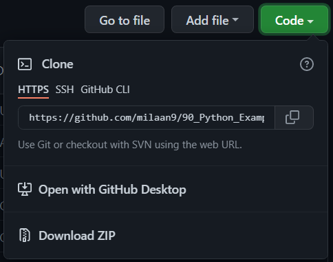

# PYTHON  FOR  DATASCIENCE  
- This repo  contains  files  used  in python  for  datascience for dsaic  club sessions.
- The  original codes are  modified  during  the  sessions.
###### How  to download  the  files  in your  computer.
- Click on `Code`, then click on download  zip
   </img>
  ###### Click on the  download  the  zip file.
##### Credits of  main files:
<a href="https://github.com/milaan9/" tartget ="_blank" > Link </a>
